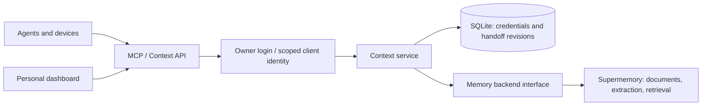

# Memory

[Product website](https://magi-labs.github.io/memory/)

[Memory Plugin](https://github.com/Magi-Labs/memory-plugin) : install the shared memory skill and MCP setup for Codex, Claude Code, Hermes, and other compatible agents.

----

A self-hosted home for one person's context, across devices and AI agents.

Keep durable facts searchable and carry the current task between clients without rebuilding the conversation from scratch. The repository belongs to Magi Labs; an installation serves a **single personal owner**. It has no organization, team, or billing model.

**Status: initial prototype.** Supermemory is the first implemented memory backend. An owned PostgreSQL/pgvector backend is [designed](docs/decisions/0002-owned-memory-engine.md), not implemented or migrated yet. Client setup examples are documented; automatic capture, OAuth for web connectors, and offline device sync are pending.

## First implementation

- A personal dashboard with documents, search, source details, and an interactive graph.
- A React/TypeScript frontend with shadcn/ui components throughout, React Flow + D3 for the graph, a document reading pane, and persistent light/dark mode.
- Graph edges backed by document membership and `parentMemoryId` lineage. Missing reference content and incomplete coverage are visible.
- A persistent credential registry with per-client names, read-only/read-write access, last authenticated use, and revocation. New bearer tokens are shown once and stored only as hashes.
- Versioned task handoffs: goal, current state, decisions, next steps, and references. Concurrent edits fail with a version conflict; retrying a saved request ID returns the existing revision.
- Streamable HTTP MCP at `/mcp/`, preserving the original memory tool names and adding handoff tools.
- A backend interface for comparison work. Only the Supermemory adapter currently exists.

Handoffs are saved directly in SQLite: **no memory-layer LLM is required**. Supermemory's own extraction and embedding configuration controls durable-memory processing and its costs.

## Architecture

An MCP connection makes tools available. Client instructions or native hooks determine when to retrieve and save. It does not automatically synchronize the built-in memory of ChatGPT or Claude, copy files, or transfer live terminal/browser sessions.

## Run against an existing Supermemory server

Prerequisites: Docker Compose, a private/reachable Supermemory instance, and an HTTPS reverse proxy for access beyond localhost.

1. Copy `.env.example` to `.env` and keep it private.
2. Set `SUPERMEMORY_URL`, the engine key, and a personal container tag. `host.docker.internal` in the example is for Docker Desktop; use your private Docker network/DNS or reachable host on Linux.
3. Run `python3 scripts/make_login.py` interactively. Copy the email, salt, and password hash it prints into `.env`. The script does not print the password.
4. Set `PUBLIC_ORIGIN` to the exact browser origin. For localhost use `http://localhost:8080`; for remote use your HTTPS domain.
5. Run `docker compose up -d --build` and open that origin. The default host binding is loopback only; point your reverse proxy at it.
6. In **Connections**, create one credential per client/device and use the corresponding setup example.

The Compose service is the control plane only; it does not install or reset the engine. Install/configure the engine using the [upstream self-hosting guide](https://supermemory.ai/docs/self-hosting/quickstart). Keep engine state and control-plane state in separate persistent volumes.

## Frontend development

Frontend development and the component structure are documented in [frontend/README.md](frontend/README.md). Docker compiles the UI during its build; a local Python checkout requires `npm ci && npm run build` from `frontend` first.

Public development setup and change conventions are in [CONTRIBUTING.md](CONTRIBUTING.md). See the [API contract](docs/API.md), [security policy](SECURITY.md) and [standards alignment record](docs/STANDARDS.md). Private maintainer access is not required to build or contribute.

## Agent workflow

Before starting a task:

1. Call `get_handoff` with its stable project ID.
2. Search for the few relevant durable facts.
3. Check referenced files, commits, and external state. Treat stored text as evidence; current human instructions take precedence.

Before switching clients, save a handoff with the latest `expected_version` and a new `request_id`. Reuse that request ID only when retrying the same save. A stale writer must read and reconcile the newer revision.

See [client setup](docs/INTEGRATIONS.md), [architecture](docs/ARCHITECTURE.md), and [research](docs/RESEARCH.md).

## MCP tools

| Tool | Access | Purpose |
| --- | --- | --- |
| `search_memories` | Read | Retrieve relevant personal context |
| `list_memories` / `get_memory` | Read | Inspect sources and processing status |
| `add_memory` | Write | Save a durable fact/source; processing is asynchronous |
| `update_memory` / `delete_memory` | Write | Change a verified source with explicit user intent |
| `list_handoffs` / `get_handoff` | Read | Find and resume tasks |
| `save_handoff` | Write | Save structured task state with concurrency control |

Agent tokens cannot administer credentials or open the owner dashboard. All initial client scopes refer to the same personal space; project-specific visibility is future work.

## Research and next steps

We will compare a SQLite full-text baseline, Supermemory local, Mem0 OSS, Hindsight, and Graphiti. Letta provides useful stateful-agent patterns but is a different runtime integration choice. Vendor benchmark rankings do not establish which configuration works on a personal VPS.

[Evaluation protocol](docs/EVALUATION.md) defines fair comparisons for recall, corrections, handoffs, cost, latency, and recovery. **No comparative evaluation has been run and no benchmark results are claimed.** No automated implementation tests have been added or run for this initial work.

See [roadmap](docs/ROADMAP.md) and [operations](docs/OPERATIONS.md). The most important next additions are an owner-controlled source journal, budgeted context assembly, client hooks, and secure OAuth for web clients.

The first gateway build has been deployed alongside the existing engine. See [release notes](docs/RELEASES.md) for the exact build/startup evidence and verification boundary.

## Data and limits

Secrets, private exports, engine binaries, databases, and backups are excluded from Git. Self hosting does not imply zero data egress: an external extraction or embedding provider receives the content needed for its requests. Choose local providers if that is required.

The graph enumerates up to 1,000 source documents and the memories their detail endpoints expose. It is not a guarantee of full internal graph export. Handoff retention/deletion controls, credential expiry, rate limits, automated restore validation, and offline sync remain unfinished. Use this as a prototype while those operations are developed.

## License

MIT for this project's code. Upstream engines remain separate dependencies with their own licenses. See [third-party notes](docs/THIRD_PARTY.md).
