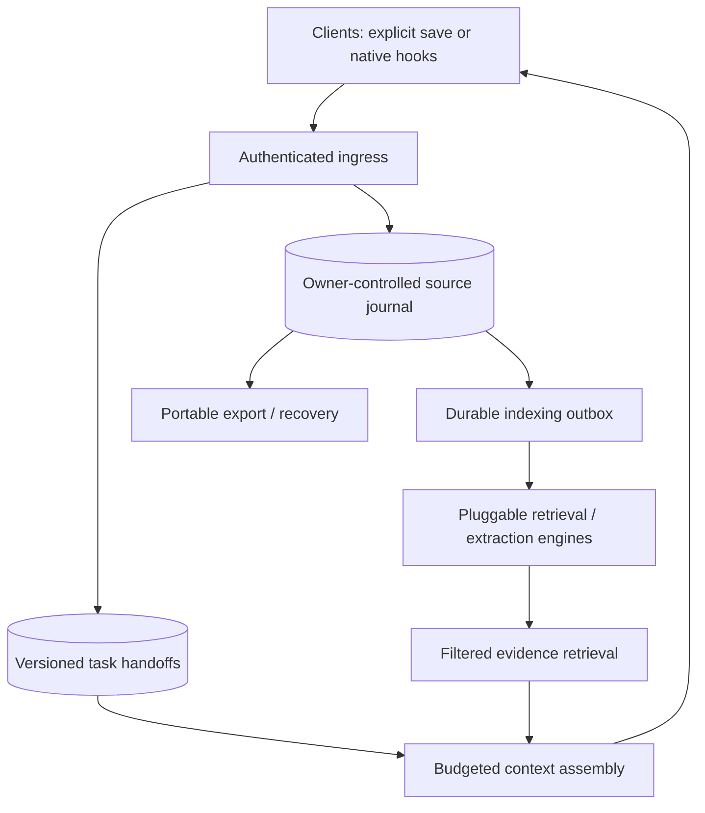

# Personal context architecture

Decision date: 3 October 2026. Scope: one human with multiple devices, clients, projects, and conversations.

## Implementation and deployment status — reviewed 5 October 2026

The implementation remains the FastAPI/FastMCP gateway, SQLite control store and Supermemory adapter described below. The last recorded deployment is gateway source `c7ca73b`, observed on 4 October; this review does not re-observe production. Later repository documentation and evidence-labeling changes are not automatically deployed. See [release notes](RELEASES.md) for build/runtime evidence and [API.md](API.md) for contracts, retries, errors and graph coverage.

## Owned-engine direction — 4 October 2026

The replacement design is recorded in [ADR 0002](decisions/0002-owned-memory-engine.md): PostgreSQL source journal, durable jobs, full-text search, optional pgvector/LLM processing, and evidence-backed facts/relationships. It is a proposed implementation; Supermemory remains the active backend. The UI now uses shadcn primitives and React Flow + D3.

## Product boundary

The desired outcome is to switch from one agent to another and continue with the right context. Saving more text is insufficient if the next client cannot identify the current task, outdated facts, or supporting evidence.

There are two data paths in the first implementation:

| Context | Owner | Storage | Update behavior |
| --- | --- | --- | --- |
| Durable facts and their sources | Human; extraction is a derived interpretation | Supermemory behind an adapter | Engine-managed asynchronous processing |
| Current task handoff | Human or explicitly participating agent | SQLite in the control plane | Append revision with compare-and-swap version |
| Device/client identity | Human | SQLite hashes and metadata | Create, observe authenticated use, revoke |

The repository is organization-owned, but the deployed product is personal. There is one owner login. A token is a delegated client identity, not a new user or organization.

## Implemented components

### 1. Transport and identity

FastAPI serves the owner dashboard and JSON endpoints. FastMCP exposes a stateless Streamable HTTP endpoint. Owner login is HTTP Basic over HTTPS, using a salted PBKDF2 password hash. Bearer credentials are high-entropy random tokens stored only as SHA-256 digests.

Read-only and read/write scopes are checked inside MCP tools and at JSON mutation routes. Owner-only routes include credential administration and dashboard configuration. Browser mutations require the configured origin and a custom request header. The dashboard uses same-origin assets and renders memory content as text.

Existing gateway bearer digests can be imported once from environment variables. Revocation lives in the persistent database and remains effective on a normal restart. Losing/restoring that database can also lose newer revocations; this must be considered in recovery.

### 2. Handoffs

A handoff has a stable project ID and contains a goal, current-state summary, decisions, next steps, and file/commit/link references. Its author is the authenticated client label. Each save creates a revision in one SQLite transaction.

`expected_version` detects a stale writer. A per-project `request_id` makes a retry of the same payload return the original result. Reusing an ID with changed content fails. There is no automatic merge and no background summarization model.

This prevents silent last-writer wins; it does not prove that an agent's summary is correct. Resuming clients must check live state. A reference to a local path does not copy that file onto another device.

### 3. Durable memory backend

The initial adapter calls Supermemory document, detail, and hybrid-search APIs. The tool-facing interface offers search/list/get/add/update/delete rather than exposing an engine SDK to every client. Document reads and mutations verify membership in the configured personal container.

Only the Supermemory adapter is implemented. Other engines would need normalization to the document/search contract and separate comparison work. The current adapter still stores durable-memory sources in Supermemory; the gateway is not yet the canonical source archive for that path.

### 4. Inspection UI

The dashboard has documents/search, graph, handoffs, and connections. Its graph displays facts attached to their source documents and parent-version relationships returned by the backend. IDs with no accessible content appear as unavailable references. It does not infer graph edges from similar words or turn an inference into a verified fact.

Source code now preserves unknown fact status/version and labels summary fallbacks when source text is unavailable. Latest-version filtering requires an explicit backend latest flag and excludes facts marked forgotten. These labels describe metadata, not independent confirmation. This correction is pending deployment as recorded in the release notes.

Credential status means issued/revoked; last-used means an authenticated request was observed. It does not establish that a client's tools loaded or that a task was completed successfully.

## Target architecture: next increment

The source journal is proposed, not implemented. It should preserve original text, source client, conversation/task ID, event timestamp, received timestamp, content hash, and explicit source authority. Store original evidence independently of derived summaries so an engine/model change can rebuild the index.

An outbox should record pending indexing operations in the same transaction as a source write, with stable external IDs, bounded retries, and visible failure state. Engine downtime must not lose a confirmed save. Index results should record engine/version/model configuration and source IDs.

Context assembly should combine: small owner-approved preferences, the latest relevant handoff, and cited retrieved evidence under a client token budget. It should label historical facts, inferences, and missing evidence. It should abstain rather than fill gaps from an unsupported summary.

Personal scopes should evolve into separate spaces such as personal, finance, and individual projects. A device token should be restricted to selected spaces. Sharing all context with every client is the prototype's current behavior, not a permanent design goal.

## LLM policy

Explicit structured saves and handoffs need no additional extraction LLM. Optional conversation ingestion can use a model to propose facts or summaries, with original evidence retained and provider/cost attribution. Retrieval should start with a deterministic baseline and embeddings; reflection or reranking only earns a place after measurable benefit.

The current engine's model/provider settings are deployment configuration. A graph pipeline can make multiple model calls; a low per-token price alone does not determine cost or correctness. External providers are a separate privacy choice from self-hosted storage.

## Device and client integration

Central server access is the initial sync mechanism. A stable project ID gives two devices the same handoff even when their paths differ. Credentials are separate per client/device for attribution and revocation.

Start with manual MCP calls and documented agent instructions. Then build client-specific adapters for start-of-task retrieval and end-of-task save where supported. Capture must be opt-in and visible; do not scrape every conversation or inject memories silently across unrelated projects.

Offline clients, local queues, tombstones, and conflict reconciliation are planned separately. Web clients require their own connector setup and authentication compatibility; a local configuration file cannot configure ChatGPT web.

## Failure cases to design around

- Source is saved but index processing fails: durable outbox and visible pending state.
- Agent misses a save hook: explicit handoff affordance; measure missing context.
- Two devices edit: reject stale version, show both revisions, let the owner reconcile.
- Fact changes: retain time and provenance; favor explicit correction over old inference.
- Duplicate capture/retry: stable request/event IDs; distinguish duplicate text from a new dated occurrence.
- Retrieved instructions attack the agent: mark memory as untrusted evidence; it cannot grant permission.
- Engine or provider changes: rebuild from source journal; do not treat encrypted engine storage as the only export.
- Deletion: remove sources, derived memories, handoffs, caches, and queued work; account for backup retention. This complete policy is unfinished.

## Success criterion

An agent on a second device can identify the right task, continue with current constraints and source references, and avoid stale or unrelated context at acceptable cost. A visually dense graph or a vendor's benchmark score is not sufficient evidence of that outcome.
