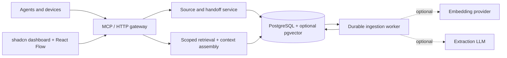

# ADR 0002: Own the personal memory model and retrieval pipeline

Date: 4 October 2026
Status: Proposed implementation design. Supermemory remains the active production engine.
Scope: One owner, multiple devices and agents. This decision does not create an organization product.

## Decision

Build an owned memory service behind the existing API/MCP boundary. Use PostgreSQL for canonical sources, revisions, facts, evidence links, relationships, handoffs, credentials, and durable jobs. Use PostgreSQL full-text search initially and pgvector for optional embedding retrieval. Keep the existing FastAPI/FastMCP gateway and React frontend.

Supermemory is useful as the current implementation, but is not an architectural requirement. Removing it requires replacing ingestion, source storage, extraction, retrieval, version handling, and operational recovery. It is not equivalent to replacing a vector database connection. We accept that maintenance responsibility to gain inspectable provenance, explicit correction rules, portable exports, and control over model calls. No claim of superior recall, latency, or cost has been established.

## What we already own and what must be replaced

| Capability | Current implementation | Target |
| --- | --- | --- |
| Owner authentication, client credentials, MCP tools | Gateway + SQLite | Preserve behavior and token hashes; migrate control tables transactionally later |
| Explicit task handoffs, compare-and-swap revisions | Gateway + SQLite | Preserve concurrency and retry semantics |
| Original durable memory documents | Supermemory | PostgreSQL source journal with revisions |
| Chunking, fact extraction and embeddings | Engine-managed | Versioned workers; independent optional model providers |
| Hybrid retrieval | Supermemory search API | Scoped SQL full-text + optional vectors + rank fusion |
| Fact versions | Engine-returned fields | Explicit fact revisions, correction/supersession links |
| Graph | Source membership + previous versions | Sources, claims, entities and typed, evidence-backed relationships |
| Export/rebuild/recovery | Incomplete ownership | Canonical export, rebuildable indexes, deletion-aware jobs |

## Runtime

Compose services: `gateway`, `worker`, `postgres`. The worker shares the application image with a separate entry point. A PostgreSQL job table avoids introducing Redis or a separate queue service initially. Graph relationships are ordinary relational tables; no dedicated graph database is required for bounded personal-context traversal. Attachments, if introduced, live on a persistent volume with database metadata and checksums; the first release supports text.

PostgreSQL is preferred over a new SQLite extension stack because we need transactional worker claims, relational constraints, full-text indexing, and optional vectors in one service. The existing SQLite control store can remain during the first increment; moving it is not a prerequisite for replacing document search.

## Data model

Use stable UUIDs internally, explicit external-ID mappings, timestamps in UTC, and `space_id` on every retrievable record. Foreign keys and service-layer checks prevent evidence links across unauthorized spaces.

| Table / aggregate | Important fields and rules |
| --- | --- |
| `spaces`, `client_space_grants` | Personal, finance, projects; server determines allowed spaces from the authenticated client, never from a model's claims |
| `sources` | Stable logical source ID, space, source kind, source client, conversation/task/project IDs, external ID, current revision, tombstone |
| `source_revisions` | Original text, content hash, observed/received timestamps, source authority, ingestion configuration; append-only until explicit purge |
| `ingestion_requests` | Unique client/request ID, payload hash, acknowledgement; identical retry returns the first result; changed payload with same ID is rejected |
| `chunks` | Source revision, exact character offsets, chunk text/hash, chunker version, full-text index |
| `facts`, `fact_revisions` | Claim text/type, subject/predicate/object where explicit, valid time, recorded time, authority, inferred flag, review state, supersedes ID |
| `fact_evidence` | Exact source revision/span; quote validation; facts without evidence remain explicitly unsupported proposals |
| `entities`, `entity_aliases` | Owner-scoped canonical IDs; ambiguous name merges require review; no automatic merging by display name |
| `relationships` | Typed endpoints, evidence IDs, valid time, origin (explicit/imported/model-proposed), review state |
| `embeddings` | Object/revision ID, provider/model/version/dimensions, input hash, vector; indexes separated by model and dimensions |
| `jobs`, `processing_runs` | Stage, source revision, lease, retry time/count, configuration digest, safe failure code, token/cost accounting |
| `external_ids`, `migration_batches` | Vendor IDs, mapped local IDs, export checksums and import completeness |
| Existing control tables | Preserve handoff versions, idempotency keys, credential digests and revocations exactly |

A confidence score is a model estimate, not evidence. Extraction of a statement does not establish its truth. Owner correction outranks an inferred summary; historical context remains available through an explicit as-of query. Do not silently erase conflicting claims or promote old financial holdings to current holdings.

## Save and indexing flow

1. Authenticate and authorize the space, enforce content limits, and validate the idempotency key.
2. In one database transaction, create the source revision, request acknowledgement and processing job. Acknowledge only after commit: `saved`, with a separate indexing status.
3. Workers claim jobs with `FOR UPDATE SKIP LOCKED`, lease them, and retry with bounded exponential backoff. Expired leases are recoverable. One unique job key per source revision/stage/configuration prevents duplicate derived output.
4. Deterministically chunk original text and build the full-text index. This mode needs no model API.
5. If enabled, embed chunks using the selected provider. If extraction is enabled, request schema-constrained proposals and validate each cited quote against the immutable source text.
6. Store proposals, provenance and configuration. Invalid evidence is a visible processing failure, not an accepted fact. Source instructions cannot trigger tools or grant access.
7. Before committing results, recheck source revision, tombstone and processing generation; a stale or deleted source must not be resurrected by a delayed worker.

Explicit `save_fact` calls from an agent can supply structured claims and source references without another extraction LLM. Agent-authored claims retain agent authority; they are not automatically owner-approved. Automatic extraction is optional, configurable per space, and independently budgeted from embeddings. No LLM is required in the ordinary retrieval path. A hosted provider receives only authorized, opted-in text; local embeddings are a separate deployment choice.

## Retrieval and context continuity

- Validate space/project/time filters before candidate generation. Both lexical and vector queries apply the same grants and exclude tombstoned or disallowed revisions.
- Retrieve full-text and, when available, vector candidates. Use reciprocal-rank fusion as the initial hybrid algorithm; preserve lexical results if the embedding service is unavailable. Do not label PostgreSQL's built-in ranking as BM25.
- Prefer relevant current facts, but retain citations and conflict flags. Recency alone never overrides an explicit authority or valid-time constraint.
- Expand at most one relationship hop with node/edge/space limits. Similar vectors do not create factual relationship edges.
- Assemble owner preferences, latest project handoff, and evidence excerpts within the caller's budget. Return citations, revision IDs, inference/history/conflict labels, and truncation metadata. Abstain when evidence is missing.
- Existing MCP names remain compatible. Add `save_fact`, `correct_fact`, `get_context`, `list_jobs`, and scoped export only after their contracts exist. A proposed `get_context(project, query, budget, as_of)` response contains structured facts, source excerpts, handoff, conflicts, and coverage metadata.
- Server tokenizers are conservative for unknown client models; budget overruns must be prevented by a final bound, not guessed text length alone.

A shared endpoint makes saved context accessible across devices. Automatic capture and recall still require each client's hooks/instructions. Web clients need compatible connectors and OAuth support; a plugin cannot claim universal automatic synchronization. Offline queues and reconciliation are a later increment.

## Graph contract

The backend supplies stable node IDs, node kind, label, provenance and typed edges. A bounded neighborhood endpoint accepts a seed, allowed-space filter, depth and limits, with pagination/truncation metadata. The UI uses React Flow's own nodes, edges, controls and interaction; it does not implement a canvas engine.

Initial edge types: `supports` (source evidence → claim), `supersedes` (new claim → prior claim), `mentions` (source → entity), and explicit domain predicates. Model-proposed links are visibly distinguishable and excluded from factual context until the applicable review policy accepts them. Imported `contains` and `previous_version` remain labeled with their original semantics. Never manufacture relations to make a graph look connected.

## Migration and rollback

1. Implement the new adapter in a separate schema/volume. Keep live Supermemory reads/writes authoritative while this is built.
2. Export all pages and every accessible document detail, extracted fact and lineage link using the existing server-side credential. Save restricted exports outside Git; include checksums, export time, count and unavailable-record manifests. Do not use the graph API's 1,000-document display limit for export.
3. Import idempotently with external-ID maps. Preserve source text, vendor IDs, timestamps and imported authority. Mark inaccessible parent facts as unresolved references. Regenerate embeddings; do not invent missing engine internals.
4. Compare counts, text hashes, references and representative retrieval behavior in an isolated namespace. Verify deletion, retry, conflict and restore behavior before declaring migration complete. This document defines required gates; it does not claim they were run.
5. For the initial small installation, use a short announced write pause. Drain in-flight work, export/reconcile the final delta, and atomically switch the backend setting. Writes must receive a retryable maintenance response during the pause, not a false success. Both MCP and dashboard use the same active adapter.
6. Keep the old engine and export recoverable. After new-engine writes begin, rollback requires a reconciled journal replay or restoring and replaying to a known point; a blind environment toggle would lose newer writes. Record the exact cutover watermark and ID maps.
7. Only retire the old engine after migration and recovery gates pass. Existing credentials and handoffs remain valid throughout.

## Deletion, export and operations

An explicit forget action creates a tombstone immediately, blocks search/context/graph access, cancels jobs, then removes source revisions and their derived chunks/vectors. Multi-source claims lose the deleted evidence and are re-evaluated; orphaned claims are removed. A deletion ledger prevents an old import/export or restored backup from resurrecting forgotten data. Minimal tombstone IDs contain no source text.

Backups are encrypted and access-controlled; restoration reapplies the deletion ledger before serving traffic. Backup retention is configured and visible. The service cannot promise to erase context already copied into an agent's history. Portable exports include original text, revisions, evidence, relationships and handoffs, without credentials or provider secrets by default.

Observe pending/failed jobs, time-to-searchability, query latency, extraction/embedding cost, and retrieval coverage. Logs contain request/record IDs and safe error categories, not memory bodies or tokens. Store models and prompts by version so derived data can be rebuilt. Use SQLAlchemy/Alembic and a PostgreSQL driver for persistence rather than handwritten migration plumbing.

## Implementation order and acceptance gates

1. Canonical schema, source journal, idempotent saves, full-text search, import/export. Preserve the current MCP document contract.
2. Durable worker, optional embeddings, provider accounting and hybrid retrieval.
3. Evidence-backed structured facts, corrections, reviewable extraction, entities and bounded graph queries.
4. Budgeted context assembly, space grants, client hooks and OAuth compatibility.
5. Verify the migration/recovery gates and cut over production; then remove the Supermemory runtime dependency.

A smaller, observable retrieval core is the first deliverable. Entity resolution, contradictory evidence, retention and unattended model extraction are substantial continuing work. Do not advertise a production-ready replacement based only on a populated graph or a successful build.

## Primary references

- [PostgreSQL full-text search](https://www.postgresql.org/docs/current/textsearch-intro.html): lexical indexing and ranking.
- [pgvector](https://github.com/pgvector/pgvector): vector similarity and hybrid search with PostgreSQL full-text search.
- [PostgreSQL SELECT locking](https://www.postgresql.org/docs/current/sql-select.html): SKIP LOCKED for queue-like consumers.
- [React Flow](https://reactflow.dev/): maintained node/edge renderer and interaction.
- [shadcn/ui components](https://ui.shadcn.com/docs/components): editable, upstream component implementations.
